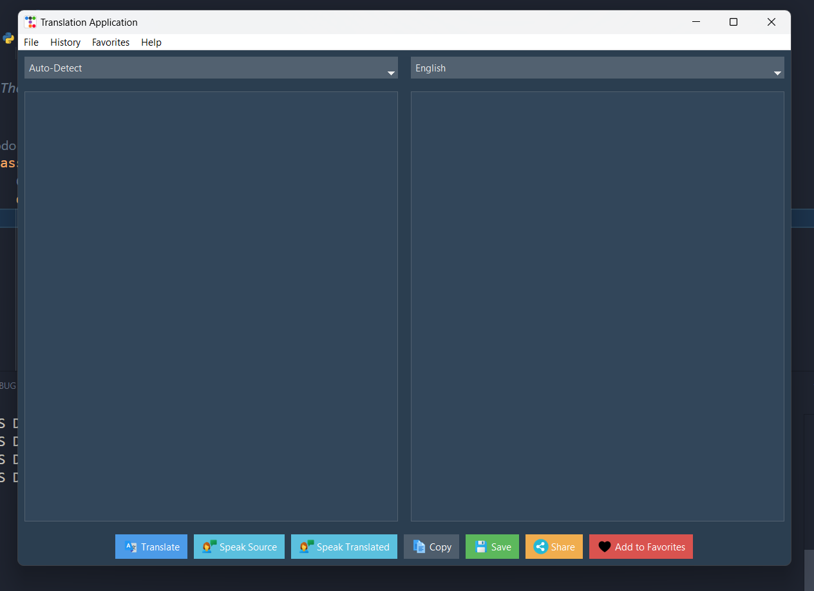
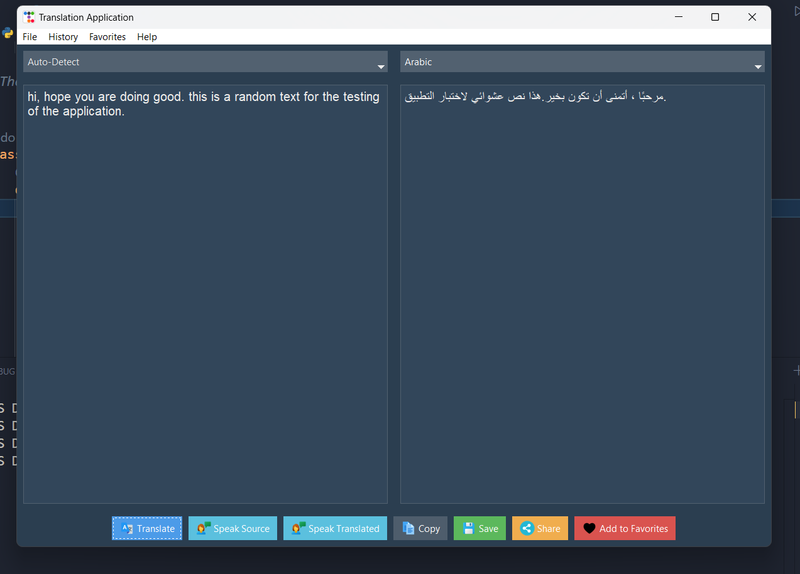
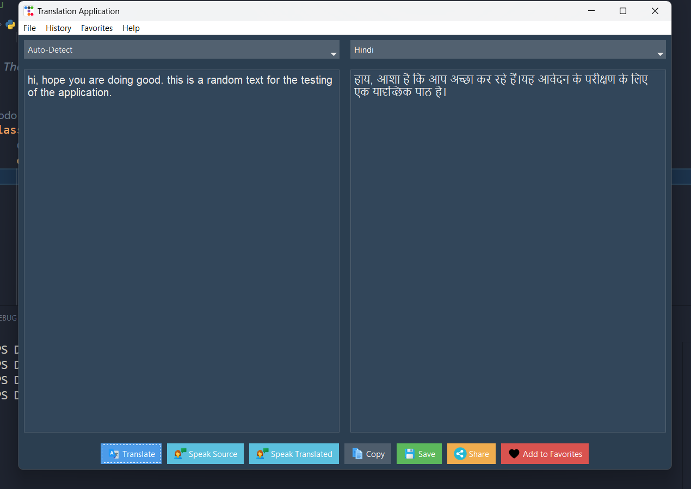
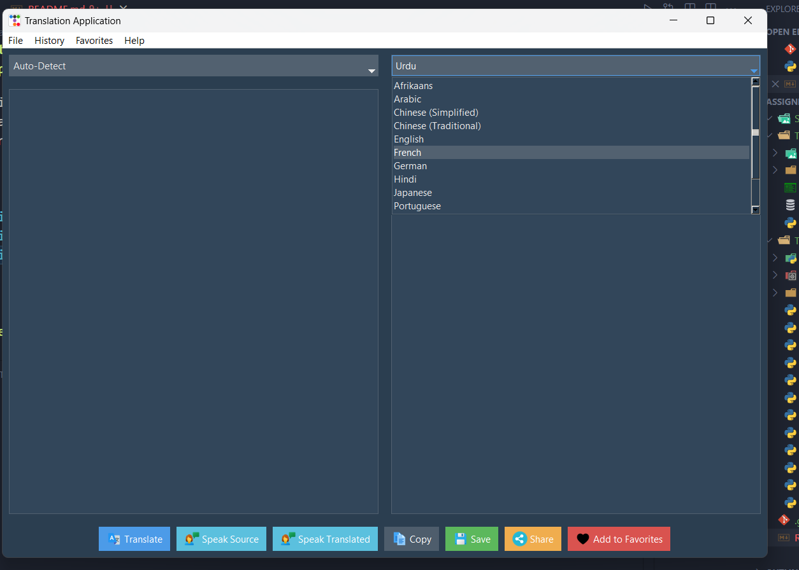
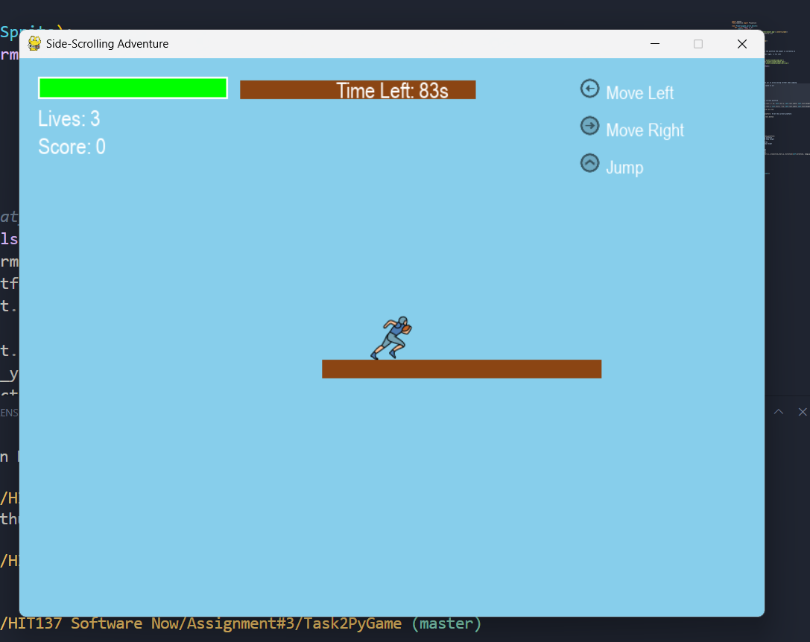
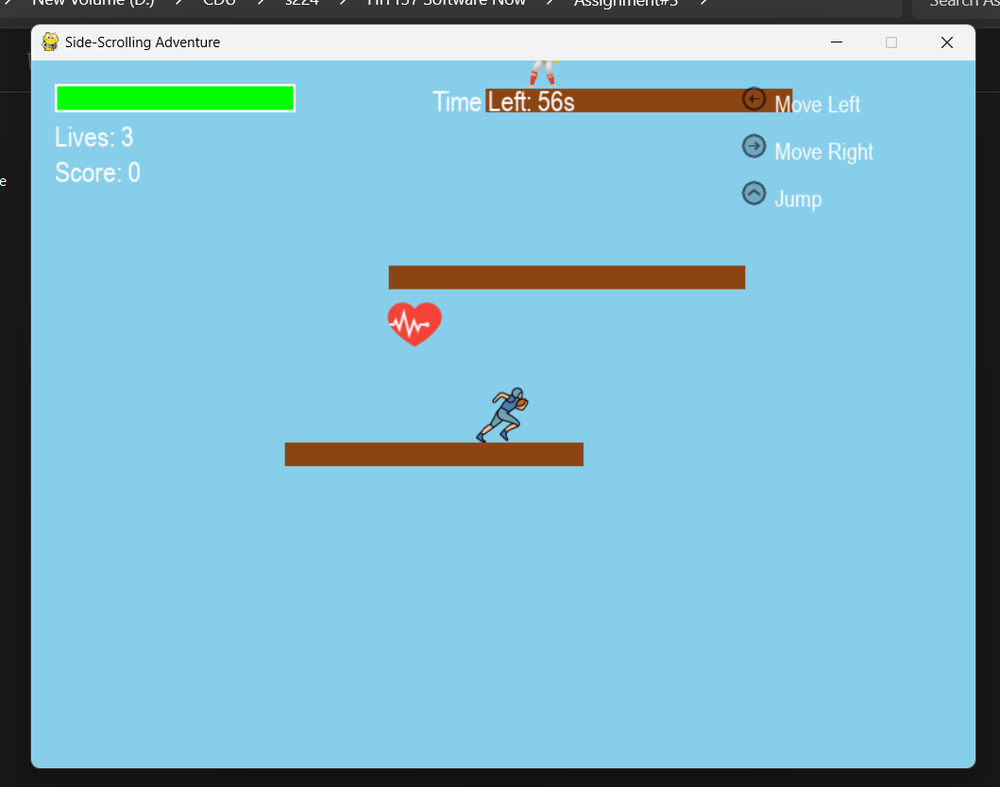
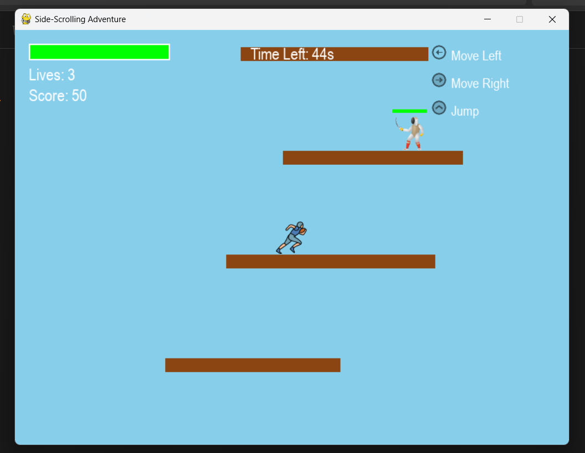

# Assignment 3 - Tkinter and Pygame Projects

This repository contains solutions for two tasks as part of the Assignment 3 submission:

1. **Task 1Tkinter**: A Tkinter Application demonstrating object-oriented programming concepts.
2. **Task 2PyGame**: A 2D side-scrolling game built using Pygame.

---

## Task 1: Tkinter Application

### Description:

This Tkinter application demonstrates the use of object-oriented programming (OOP) concepts such as inheritance, encapsulation, polymorphism, and method overriding. The project includes a desktop application that interacts with a simple AI model for image classification.

### Screenshot:






---

## Task 2: Pygame Side-Scrolling Game

### Description:

This is a 2D side-scrolling game built using Pygame. The game includes a player character that can jump, shoot projectiles, and collect items. The game also features enemies, collectibles, and three levels, including a boss battle at the end of the final level.

### Features:

- **Player Movements**: Run, jump, and shoot projectiles.
- **Enemies**: AI-controlled enemies with health and damage systems.
- **Scoring System**: Tracks score based on enemies defeated and items collected.
- **Health and Lives**: The player has a health bar and lives system.
- **Three Levels**: Includes a dynamic camera system that follows the player smoothly.
- **Bonus Feature**: The camera dynamically follows the player as they move, creating a more immersive experience.

### Screenshots:





---

## How to Run

### Task 1 (Tkinter):

1. Navigate to the `Task1-Tkinter` directory.
2. Run the following command:
   ```bash
   python translator_ap.py
   ```

### Task 2 (Pygame):

1. Navigate to the `Task2-Pygame` directory.
2. Run the following command:
   ```bash
   python main.py
   ```

---

## GitHub Repository

This project is publicly available at: [Assignment3-Tkinter-Pygame](https://github.com/osmanjajja/Assignment3-Tkinter-Pygame)
